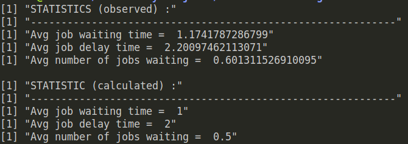

## Discrete Event Simulation

A *discrete-event simulation (DES)* models the operation of a system as a (discrete) sequence of events in time. Each event occurs at a particular instant in time and marks a change of state in the system.

Implemented discrete event simulation in R language to simulate a M/M/1 queuing system. 

Time complexity = O(n) <br> 
where, n = the number of events

Mean job arrival rate (lambda) and Mean job service time (mu) can be changed in the the code to see the effect w.r.t ratio rho (lambda/mu).

Execute by:
```
Rscript discrete_event_sim.R
```

Output:

